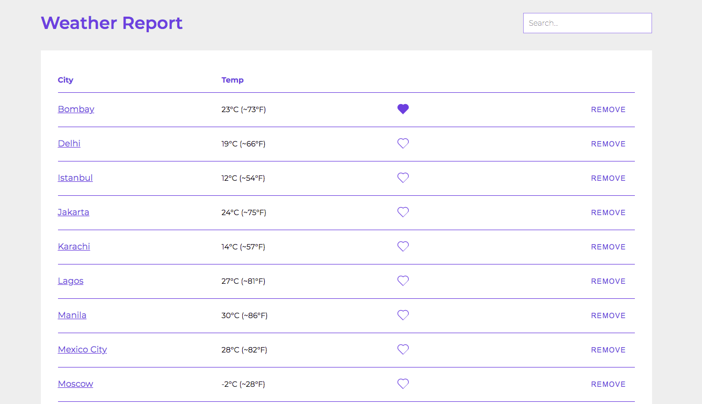

# Weather Report

There are mainly two pages in the application:
1. Home Page - Displays list of cities
2. Details Page - Displays details of a particular city

## Features

- See weather conditions of top cities by population
- Remove unwanted cities
- Restore cities that were removed previously
- Favorite cities
- Save notes for each city
- Fully responsive
- Works online as well as offline

 
 
 

## Live app link

You can check the live app here: https://master--tender-pare-dd5b54.netlify.app/

 
 
 

## Video explaining the features of this project

https://drive.google.com/file/d/1Emir0kX6pbOJZZlp-6L0r95YKZuuasAX/view?usp=sharing

 
 
 

## Some screenshots of the app

Home Page

 
 
 

Details Page

 
 
 

404 Page

 
 

<strong>Documentation is split into multiple files for the ease of use and update.</strong>

 
 

**To check how each page works, please check the documentation of each page here:**

[Home Page](src/pages/Home/README.md)

[City-Weather Details Page](src/pages/WeatherInfo/README.md)

 
 

**Please check the documentation of each component here:**

[Layout](src/components/Layout/README.md)

[Loader](src/components/Loader/README.md)

[Table](src/components/Table/README.md)

[Dialog Opener](src/components/DialogOpener/README.md)

[Confirmation Dialog](src/components/ConfirmationDialog/README.md)

[Input](src/components/Input/README.md)

[Favorite](src/components/Favorite/README.md)

 
 

**Please check the documentation of common hooks/functions used:**

[useCity Hook](src/shared/useCity/README.md)

[useWeather Hook](src/shared/useWeather/README.md)

[Notifier](src/shared/notifier/README.md)

[Local storage actions](src/shared/actions/README.md)

[Utility Functions](src/shared/utils/README.md)
