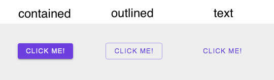
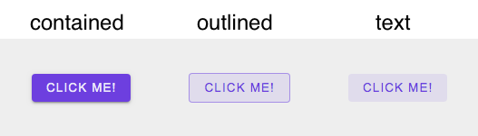

# Button

## Code Example

```jsx
  <Button className="click-me" variant="outlined" onClick={() => {}}>
    Click Me!
  </Button>
```

<br />
<br />

---

<br />

## Props

\* indicates required fields

|PropName | Default Value | Type | Description |
|---------|---------------|-----------------|-------------|
| children* | - | ReactNode | It will display whatever is passed in as children |
| onClick* | - |  React.MouseEventHandler | The function passed to onClick prop will be executed when user clicks on button |
| type   | button        | button <br /> submit <br /> reset | It sets the type of a button |
| variant | contained | contained <br /> outlined <br /> text | It will add corresponding css class to the button and button will style itself accordingly |
| className | - | string | It will add css class to the button |
| disabled | false | boolean | It will decide if button is clickable |

<br />
<br />

---

<br />

## Images

Button Variants - Normal



<br />

Button Variants - Hover



<br />

Button Variants - Active


<br />

Button Variants - Disabled


