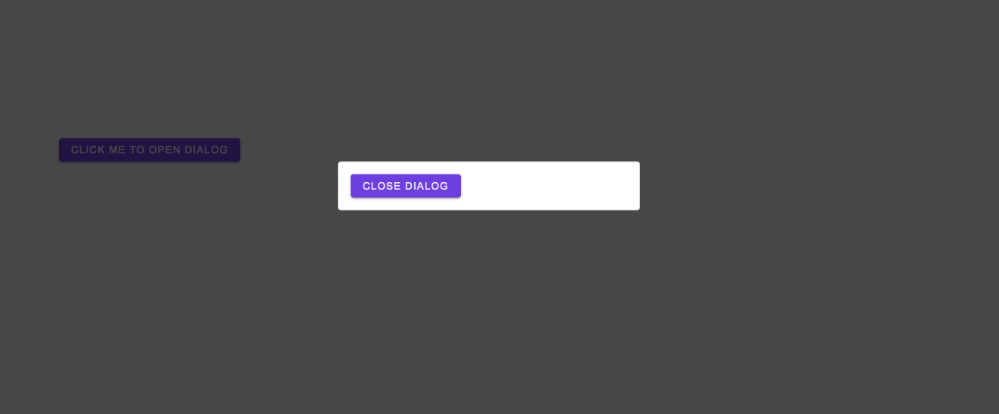
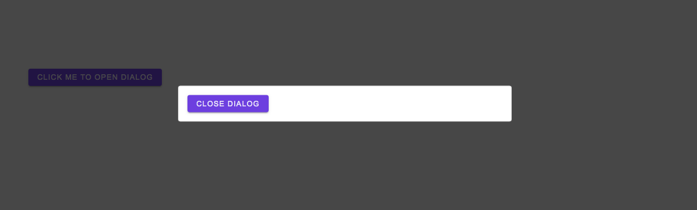
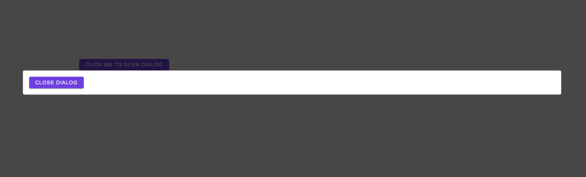

# DialogOpener

## Code Example

```jsx
  <DialogOpener
    component={(open: OpenFunction) => (
      <Button onClick={open}>Click Me to Open Dialog</Button>
    )}
    dialogSize="small"
  >
    {
      (close: CloseFunction) => (
        <Button onClick={close}>Close Dialog</Button>
      )
    }
  </DialogOpener>
```

<br />
<br />

---

<br />

## Props

\* indicates required fields

|PropName | Default Value | Type | Description |
|---------|---------------|-----------------|-------------|
| component* | - | (open: OpenFunction) => ReactNode | Render the component that will open dialog and call open handle on its click or related event |
| children* | - |  (close: CloseFunction) => ReactNode | Render the component that will render inside dialog and call close handle to close the dialog |
| dialogSize | small | small <br /> medium <br /> large | It sets the width of the dialog. Height of the dialog is automatically calculated based on its content. To change height of the dialog, add padding to the content. Please note that this property has no effect on mobile screens. |
| className | - | string | sets class on dialog component |

<br />
<br />

---

<br />

## Images

Dialog - Small



<br />

Dialog - Medium



<br />

Dialog - Large



<br />

Dialog - Mobile


