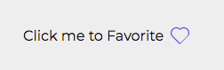
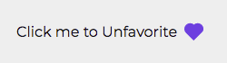

# Favorite

## Code Example

```jsx
  const [isFavorite, setIsFavorite] = useState(false);

  const handleFavoriteChange = (event: React.ChangeEvent<HTMLInputElement>) => {
    const { checked } = event.target;
    setIsFavorite(checked);
  }

  <Favorite
    name="fav"
    label={`Click me to ${isFavorite ? 'Unfavorite' : 'Favorite'}`}
    checked={isFavorite}
    onChange={handleFavoriteChange}
  />
```

<br />
<br />

---

<br />

## Props

\* indicates required fields

|PropName | Default Value | Type | Description |
|---------|---------------|-----------------|-------------|
| id | - | string | Sets id of HTML input |
| name* | - |  string | Sets name of HTML input |
| label   | -        | string | Sets text to be displayed along side heart |
| checked* | - | boolean | If checked, icon will appear as filled, otherwise icon will have only border |
| onChange* | - | React.ChangeEventHandler | The function attached to onChange will be executed when user clicks on Favorite Icon or Label |

<br />
<br />

---

<br />

## Images

Favorite - Unchecked



<br />

Favorite - Checked


