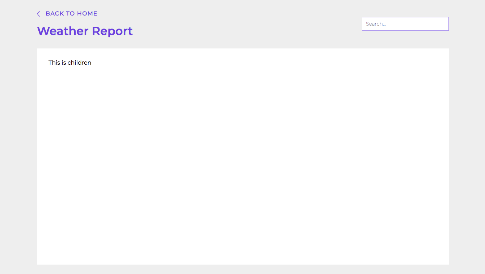

# Layout

Layout renders 2 components:
1. Page Header
2. Page Content

## Page Header

Page Header will render:
1. Back to Home Button
2. Heading saying "Weather Report"
3. Search Textbox where user can search search for a city

## Page Content

Page Content will render whatever is passed as children

<br />
<br />

---

<br />

## Code Example

```jsx
  <Layout>
    <h1>Hello</h1>
  </Layout>
```

<br />
<br />

---

<br />

## Props

\* indicates required fields

|PropName | Default Value | Type | Description |
|---------|---------------|-----------------|-------------|
| children* | - | ReactNode | will be passed on children to page content, which will render whatever is passed in |
| className | - |  string | root element of this component will get the class that is passed in as className  |
| showHeaderBackButton   | false | true <br /> false | will be passed on to page header which will render the back button if this property is true, otherwise it will hide the back button |

<br />
<br />

---

<br />

## Images

Layout - Normal


<br />

Layout - Back button



