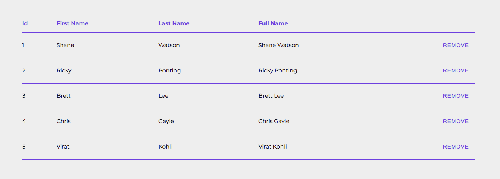

# Table

## Code Example

```jsx
  interface Item {
    id: number;
    firstName: string;
    lastName: string;
  };

  const columns = [
    {
      header: 'Id',
      accessor: 'id',
    },
    {
      header: 'First Name',
      accessor: 'firstName',
    },
    {
      header: 'Last Name',
      accessor: 'lastName',
    },
    {
      header: 'Full Name',
      cell: ({ firstName, lastName }: Item) => `${firstName} ${lastName}`,
    },
    {
      header: '',
      cell: ({ id }: Item) => <Button variant="text" onClick={() => console.log(id)}>Remove</Button>,
      textAlign: 'right' as TextAlign,
    },
  ];

  const items: Item[] = [
    { id: 1, firstName: 'Shane', lastName: 'Watson' },
    { id: 2, firstName: 'Ricky', lastName: 'Ponting' },
    { id: 3, firstName: 'Brett', lastName: 'Lee' },
    { id: 4, firstName: 'Chris', lastName: 'Gayle' },
    { id: 5, firstName: 'Virat', lastName: 'Kohli' },
  ];

  <Table columns={columns} items={items} />
```

<br />
<br />

---

<br />

## Props

\* indicates required fields

<table>
  <thead>
    <tr>
      <th>PropName</th>
      <th>Default Value</th>
      <th>Type</th>
      <th>Description</th>
    </tr>
  </thead>
  <tbody>
    <tr>
      <td>
        columns*
      </td>
      <td>
        -
      </td>
      <td>
        Array of &lt;U&gt;
      </td>
      <td>
        <table>
          <thead>
            <tr>
              <th>PropName</th>
              <th>Default Value</th>
              <th>Type</th>
              <th>Description</th>
            </tr>
          </thead>
          <tbody>
            <tr>
              <td>accessor</td>
              <td>-</td>
              <td>string</td>
              <td>Value of this property decides which key should be picked from item to display data. This property should only be used if items is an object and cell property is not in use.</td>
            </tr>
            <tr>
              <td>cell</td>
              <td>-</td>
              <td>(item: T) => ReactNode</td>
              <td>Value of this key defines the cell template. This property should only be used if accessor is not in use.</td>
            </tr>
            <tr>
              <td>header</td>
              <td>-</td>
              <td>string</td>
              <td>Value of this property will be displayed in Column Header</td>
            </tr>
            <tr>
              <td>width</td>
              <td>-</td>
              <td>string | number</td>
              <td>This property is used to define fixed width of column.</td>
            </tr>
            <tr>
              <td>textAlign</td>
              <td>-</td>
              <td>left <br /> right <br /> center</td>
              <td>This property is used to define alignment of column.</td>
            </tr>
          </tbody>
        </table>
      </td>
    </tr>
    <tr>
      <td>
        items*
      </td>
      <td>
        -
      </td>
      <td>
        Array of &lt;T&gt;
      </td>
      <td>
        Array of items
      </td>
    </tr>
    <tr>
      <td>
        className
      </td>
      <td>
        -
      </td>
      <td>
        string
      </td>
      <td>
        It sets class attribute on html table element
      </td>
    </tr>
    <tr>
      <td>
        loading
      </td>
      <td>
        false
      </td>
      <td>
        boolean
      </td>
      <td>
        It will decide to show a loader or not
      </td>
    </tr>
    <tr>
      <td>
        noDataMessage
      </td>
      <td>
        No data available
      </td>
      <td>
        string
      </td>
      <td>
        If items is empty, then message passed into this prop will be shown
      </td>
    </tr>
    <tr>
      <td>
        sitckyHeader
      </td>
      <td>
        false
      </td>
      <td>
        boolean
      </td>
      <td>
        When scrolling, if Header needs to stick at the top, then set this property to true
      </td>
    </tr>
  </tbody>
</table>

<br />
<br />

---

<br />

## Images

Table


