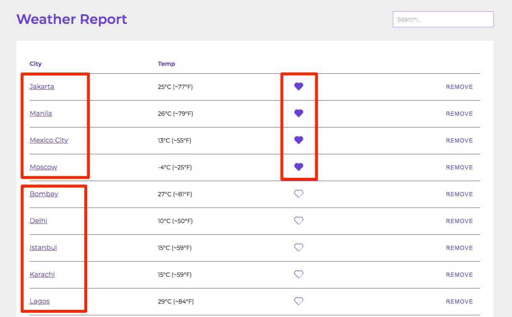
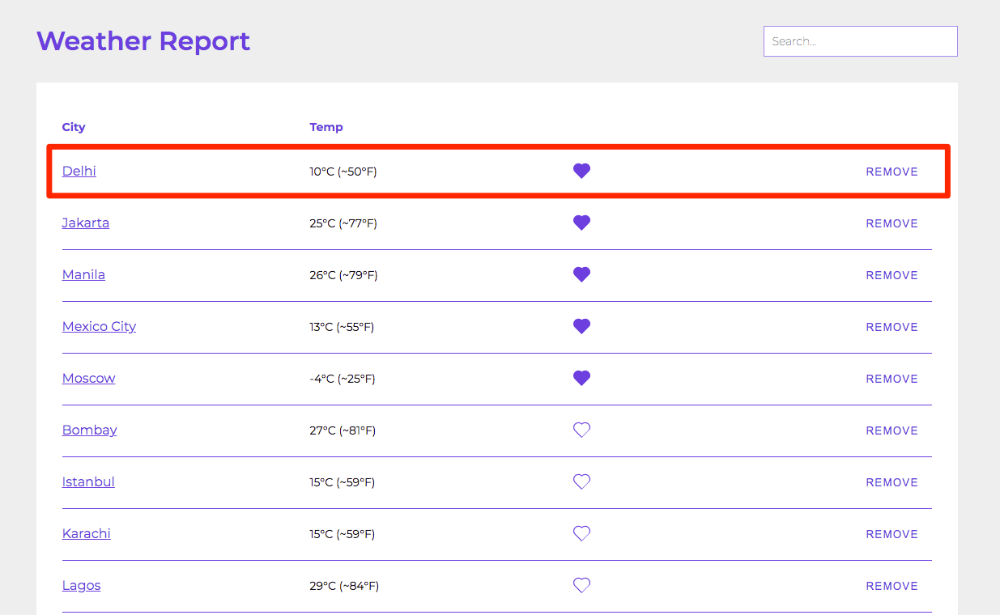
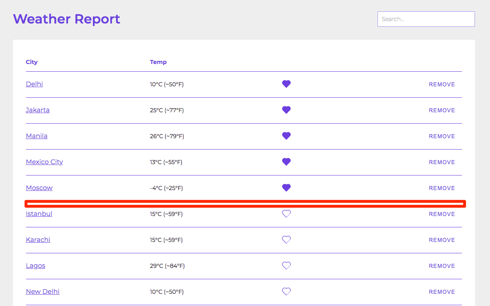

# Home

This page will be rendered inside Layout component.

 
 
 

## Functioning

 - A list of 15 largest cities by population is fetched .
 - removed cities are removed from the data.
 - resotred cities are added to the data.
 - favorite cities are added to the data.
 - the data will be passed on to the weather API to get the weather data.
 - The returned weather data is then passed on to Weather Report component

This component will display a notification whenever there is an error returned from either of the API calls.

It will show no data message if it was unable to fetch the data.

It will render WeatherReport component.

 
 

 

Inside Weather Report:

This component will sort the data first by favorites and then by alphabetical order.

 

**User clicks on remove button**
 - he will see a dialog to confirm.

 

**user confirms**
 - city will be removed from the table (even if it is favorite), and will see a notification.

 

**user click on favorites or unfavorite any city**
 - data will be reordered, and user will see a notification.

 

**user removes all the cities**
- he will be presented with a button to fetch more cities.

 

**user clicks on fetch new cities**
- new cities will appear in the list.

 
 
 

## Rendering

Data will then be displayed in Table having 4 columns:
1. City
2. Temperature
3. Is Favorite 
4. Remove

 
 
 

Cities are first sorted by favorite and then in alphabetical order

 
 
 

When user clicks on favorite, data is sorted again:

 

Initially

 

After favoriting a city

 
 
 

When user clicks on remove, he sees a confirmation and after confirm, city is not present:

 
 
 

When user removes all cities, he will get an option to get new cities, when he clicks on fetch new cities, new data will be fetched and displayed:

 
 
 

Fetch new cities is disabled if user is offline:

