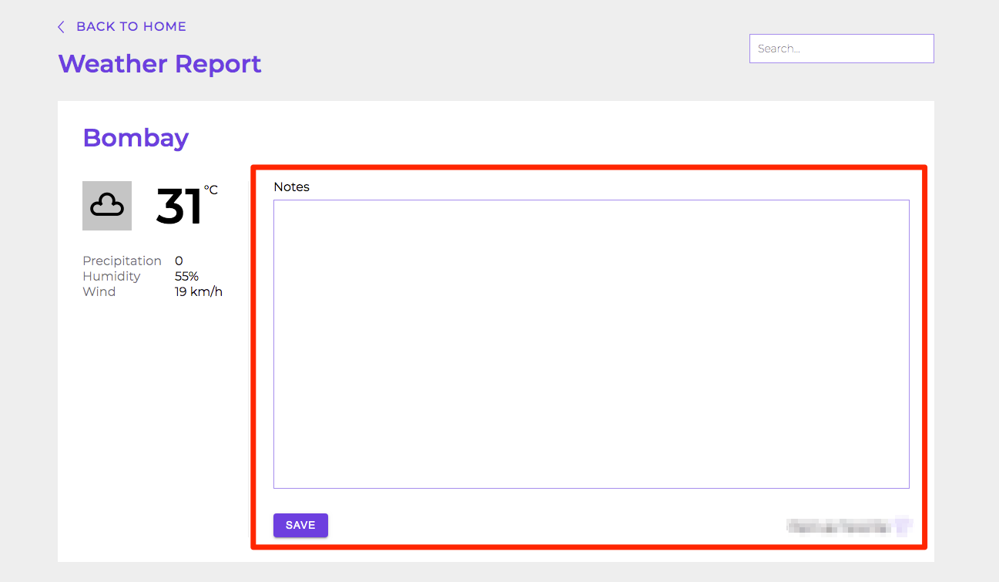
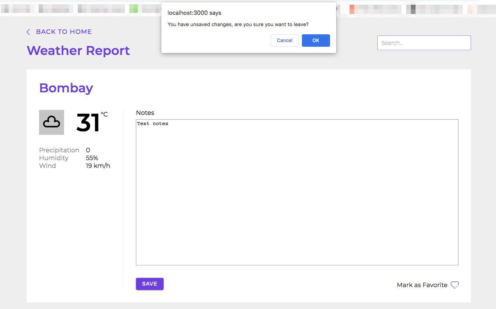
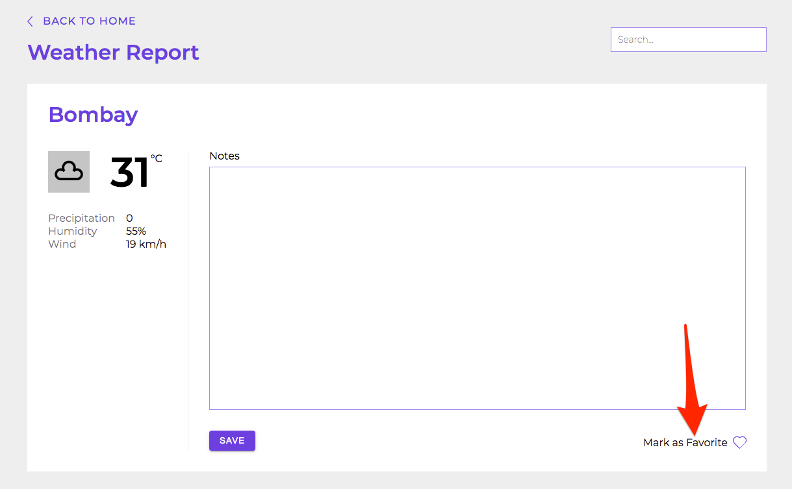
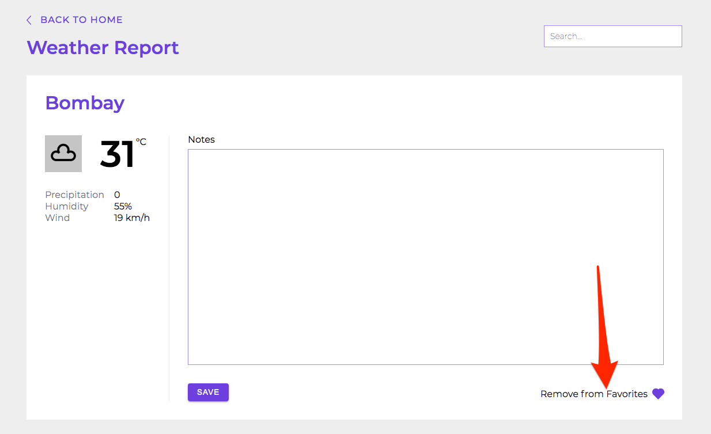

# Weather Info

This page is rendered inside Layout component having **back to home** link.

 
 
 

## Functioning

**Initially**
- Gets city name from url
- Fetches weather data for the city

 

**Save Click**
- saves notes to user-data in local-storage

 

**Restore**
- removes city from removed-cities in local-storage
- saves city name in restored-cities in local-storage

 

**Mark/Unmark as favorite**
- saves favorite as true or false to user-data in local-storage

 
 

---

 

## Rendering

 
 
 

Displays city and weather information on the page

 
 
 

Displays a text area, where user can add or edit notes

User can save notes by clicking on save button

 
 
 

User will see an alert if notes is not saved and he is moving away from the page

 
 
 

Restore button will be displayed if user has removed city on the Home page

 
 
 

Favorite/Unfavorite will be displayed depending on its current status if city is not removed.

