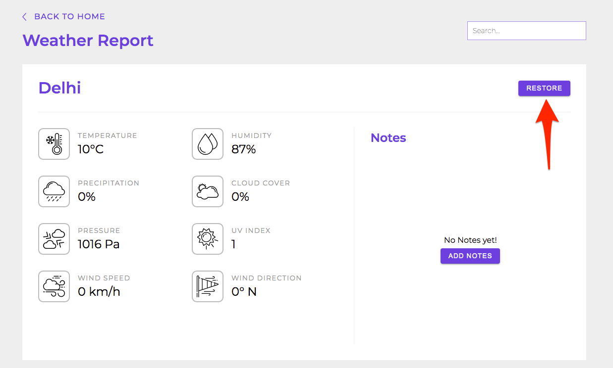

# Weather Info

This page is rendered inside Layout component having **back to home** link.

 
 
 

## Functioning

**Initially**
- Gets city name from url
- Fetches weather data for the city

 

**Add Notes Click**
 - Shows textarea to enter notes

**Cancel Click**
 - Put textarea in readonly mode

**Save Click**
- saves notes to user-data in local-storage
  
**Edit Click**
- Puts textarea in editing mode
  
**Edit Click**
- shows delete confirmation dialog
- on click of confirm, it will remove notes from user-data in local-storage

 

**Restore**
- removes city from removed-cities in local-storage
- saves city name in restored-cities in local-storage

 

**Mark/Unmark as favorite**
- saves favorite as true or false to user-data in local-storage

 
 

---

 

## Rendering

 
 
 

Displays city and weather information on the page

 
 
 

Restore button will be displayed if user has removed city on the Home page

 
 
 

Favorite/Unfavorite will be displayed depending on its current favorite status if city is not removed.

 
 
 

When there are no notes, no notes message along with add notes button is displayed.

 
 
 

On click of Add notes, text editor is displayed

 
 
 

Shows saved notes when saved.

 
 
 

When user tries to leave the page with unsaved notes, a dialog will be displayed.

 
 
 

On click of delete button, we can see delete notes dialog

