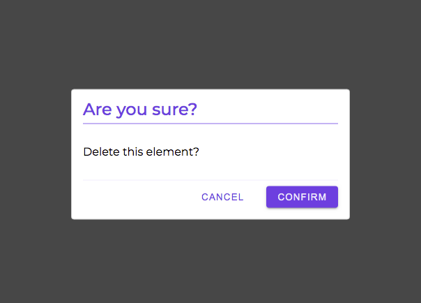
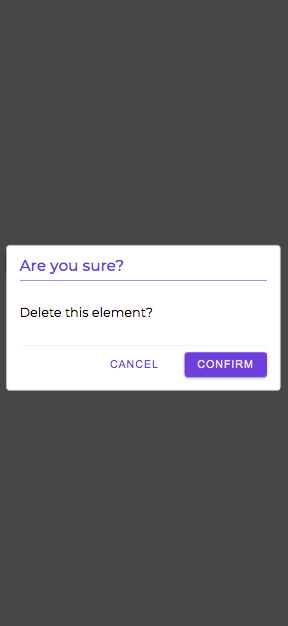

# ConfirmationDialog
This comopnent is intended to be rendered inside Dialog Opener or inside Dialog.

## Code Example

```jsx
  <DialogOpener
    component={(open: OpenFunction) => (
      <Button onClick={open}>Click Me to Open Dialog</Button>
    )}
    dialogSize="small"
  >
    {
      (close: CloseFunction) => (
        <ConfirmationDialog
          title="Are you sure?"
          onCancel={() => close()}
          onConfirm={() => {
            // do some work here
            close();
          }}
        >
          Delete this element?
        </ConfirmationDialog>
      )
    }
  </DialogOpener>
```

<br />
<br />

---

<br />

## Props

\* indicates required fields

|PropName | Default Value | Type | Description |
|---------|---------------|-----------------|-------------|
| title* | - | string | It sets title of the dialog |
| children* | - |  string | It sets the content of the dialog |
| onCancel | - | CloseFunction | This function is intended to close the dialog. CloseFunction is imported from DialogOpener Component |
| onConfirm | - | React.MouseEventHandler | This function is intended to do some work (or call some API) and then can call the close function to close the dialog |

<br />
<br />

---

<br />

## Images

Confirmation Dialog



<br />

Confirmation Dialog - Mobile


