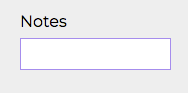
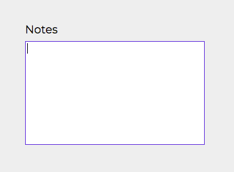

# Input

## Code Example

```jsx
  const [notes, setNotes] = useState('');

  const handleNotesChange = (event: React.ChangeEvent<HTMLInputElement>) => {
    const { value } = event.target;
    setNotes(value);
  }

  <Input
    name="notes"
    label="Notes"
    type="textarea"
    value={notes}
    onChange={handleNotesChange}
  />
```

<br />
<br />

---

<br />

## Props

\* indicates required fields

|PropName | Default Value | Type | Description |
|---------|---------------|-----------------|-------------|
| id | value of name | string | It sets id attribute of input or textarea |
| name* | - |  string | It sets name attribute of input or textarea |
| label | - | string | It sets the text of label to be displayed at top of the input or textarea |
| type | text | text <br /> number <br /> email <br /> password <br /> textarea | It sets the type of input element. If type is set as textarea, then it renders textarea instead of input |
| className | - | string | It will add css class to the input or textarea |
| value* | - | string | It sets value attribute of input or textarea |
| onChange* | - | React.ChangeEventHandler | This function is called when user types/pastes/removes value in the input or textarea |
| rows | 4 | number | It sets number of rows to be displayed on textarea. It has no effect on input. |

<br />
<br />

---

<br />

## Images

Input



<br />

Textarea


