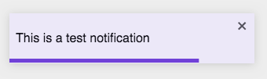
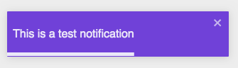

# Notifier

## Code Example

### showNotification

```jsx
  showNotification('This is a test Notification', 'success', 3000);
```

### dismissNotification

```jsx
  const notificationId = showNotification('This is a test Notification', 'success', 3000);
  dismissNotification(notificationId);
```

<br />
<br />

---

<br />

## Props

### showNotification

**returnValue type**: Promise<ReactText>

\* indicates required fields

|PropName | Default Value | Type | Description |
|---------|---------------|-----------------|-------------|
| message* | - | string | This message will be displayed on the notification |
| type | success | success <br /> error | If type is success, then background will be light blue. Else background will be dark blue. Please see images at the end of the document |
| timeout | 5000 | number | Notification will disappear after timeout elapses |

<br />
<br />

### dismissNotification

**returnValue type**: void

\* indicates required fields

|PropName | Default Value | Type | Description |
|---------|---------------|-----------------|-------------|
| toastId* | - | Promise<ReactText> | Pass the promise that is recieved when showNotification was called |

<br />
<br />

---

<br />

## Images

Notifier - Success



<br />

Notifier - Error


